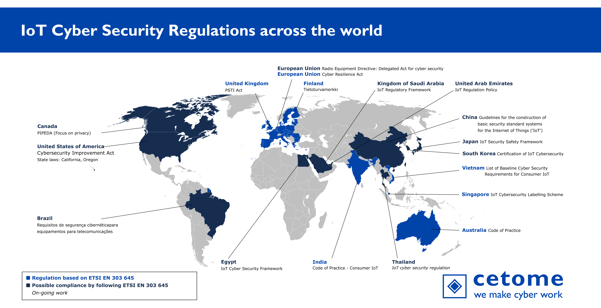

# Panorama of IoT Cyber Security Regulations across the World
This panorama presents the list of IoT cyber security regulations, policies, and laws across the world.
Most information was collected through public means.

Current countries and zones with IoT cyber security regulations:
- 🇦🇺 Australia
- 🇧🇷 Brazil 
- 🇨🇦 Canada
- 🇨🇳 China
- 🇪🇺 European Union
- 🇫🇮 Finland
- 🇮🇳 India
- 🇯🇵 Japan
- 🇸🇦 Kingdom of Saudi Arabia
- 🇴🇲 Oman
- 🇸🇬 Singapore
- 🇹🇭 Thailand *Preliminary work announced. More information needed.*
- 🇦🇪 United Arab Emirates
- 🇬🇧 United Kingdom
- 🇺🇸 United States of America
- 🇻🇳 Vietnam

If you want to reference this work, please refer to this GitHub page directly or to [cetome.com/panorama](https://cetome.com/panorama).
This is to limit forks and consolidate efforts.

*Note: You can generate your own panorama with a subset of information. The regulations are available in YAML files stored in "country/". The generation script and its settings are available in "src/". This will generate files in your working directory. This requires the following dependencies: Python 3, PyYAML, pandas, tabulate.*

# Map of IoT Cyber Security Regulations

# Summary table
The table presents results using indicators:
- **✅ Yes**, **🆗 Partially**, **❌ No** and **🛑 N/A** (Not Applicable) when the information is available.
- **❔ TBC** (To Be Confirmed) when no information is available due to an on-going development.

[Download a picture of the summary table](table.png)

[Access the HTML version of the summary table](https://cetome.com/panorama)
